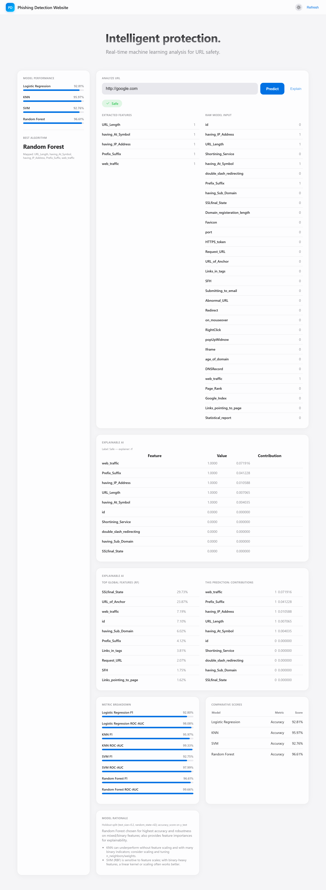
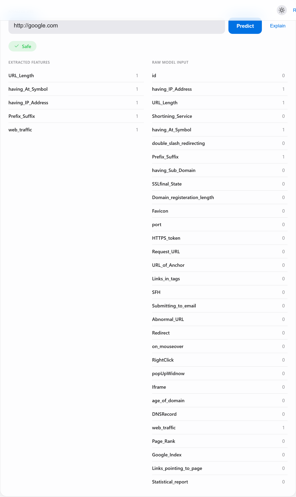
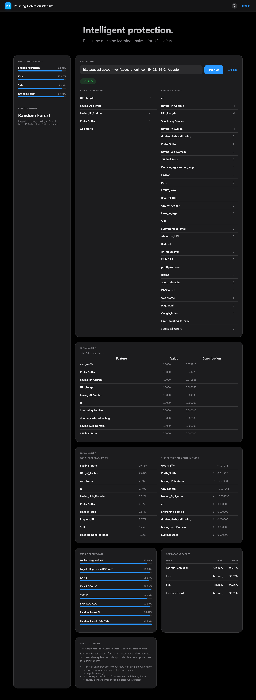

# Phishing Detection using Machine Learning

A machine learning web application that detects phishing websites from URL-based
features. It trains and compares four classifiers (Logistic Regression, KNN, SVM,
and Random Forest) on a labelled phishing dataset, serves predictions through a
lightweight Python HTTP server, and ships with a clean, responsive web interface
that includes model metrics and explainability (feature importances / SHAP).

Paste a URL, hit **Predict**, and the app extracts URL-based signals, runs them
through the trained Random Forest, and returns a **Safe / Phishing** verdict
alongside the exact features used, a side-by-side model comparison, and an
explanation of *why* the model decided what it did.

## Preview

The dashboard combines live prediction, a model-performance sidebar, explainable-AI
panels, and a full metric breakdown on a single page.



### Live URL analysis

Enter any URL to get an instant verdict, the features extracted from it, and the
raw row fed to the model.



### Dark mode

The interface ships with a built-in light/dark theme toggle.



## Features

- **Four ML models compared** — Logistic Regression, KNN, SVM, and Random Forest,
  with hyperparameter tuning via `GridSearchCV` for KNN and SVM.
- **Best model served** — Random Forest (~96.6% accuracy) is used for live predictions.
- **URL feature extraction** — derives indicators such as URL length, `@` symbol
  presence, IP-address hostnames, prefix/suffix hyphenation, and host-based traffic
  heuristics directly from a submitted URL.
- **Explainability** — global Random Forest feature importances and per-prediction
  contributions, with optional [SHAP](https://github.com/shap/shap) values when the
  package is installed.
- **Modern UI** — single-page interface (`index.html`) with light/dark themes,
  metrics dashboard, and prediction explanations.
- **Zero heavy frameworks** — the backend uses only Python's standard-library
  `http.server`, plus scikit-learn / pandas / numpy.

## Project structure

```
.
├── app.py                 # HTTP server, model training/caching, prediction & explain endpoints
├── index.html             # Single-page web frontend
├── phishing.csv           # Labelled dataset (30 features + Result)
├── rf_model.pkl           # Cached trained Random Forest model
├── rf_meta.json           # Cached feature names and model accuracies
├── requirements.txt       # Python dependencies
├── images/                # Screenshots used in this README
└── Report and PPT/        # Project report (PDF/DOCX) and presentation
```

## Getting started

### Prerequisites

- Python 3.9+

### Installation

```bash
# (optional) create a virtual environment
python -m venv venv
# Windows
venv\Scripts\activate
# macOS / Linux
source venv/bin/activate

pip install -r requirements.txt
```

### Run

```bash
python app.py
```

Then open <http://localhost:8000/> in your browser.

On first run the app loads the cached model from `rf_model.pkl`. If the cache is
missing it trains all four models from `phishing.csv` and writes a fresh cache.

## How it works

1. **Data** — `phishing.csv` contains 30 engineered features per URL and a binary
   `Result` label (`1` = safe, `-1` = phishing).
2. **Training** — `train_all_models` performs a stratified 80/20 holdout split,
   scales features where appropriate, tunes KNN/SVM with cross-validated grid
   search, and records accuracy plus a full classification report, confusion
   matrix, and ROC-AUC for each model.
3. **Serving** — the Random Forest model answers `POST /predict`. Features for an
   incoming URL are extracted on the fly and mapped onto the model's expected
   feature columns.
4. **Explaining** — `GET /explain` returns global importances; `POST /explain`
   returns per-URL contributions (SHAP when available, importance-weighted
   fallback otherwise).

### API endpoints

| Method | Path        | Description                                  |
|--------|-------------|----------------------------------------------|
| GET    | `/`         | Serves the web interface                     |
| GET    | `/metrics`  | Model accuracies, params, and metrics (JSON) |
| GET    | `/explain`  | Global feature importances (JSON)            |
| POST   | `/predict`  | Predict safe/phishing for a URL (JSON)       |
| POST   | `/explain`  | Per-URL prediction explanation (JSON)        |

## Model results

| Model               | Accuracy |
|---------------------|----------|
| Random Forest       | 96.6%    |
| KNN                 | 95.9%    |
| Logistic Regression | 92.8%    |
| SVM                 | 92.8%    |

## License

This project is released under the [MIT License](LICENSE).
